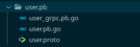

# Configuración GRPC
**Contenido**
- [Protocol Buffers](#protocol-buffers)
- [Servidor](#servidor)
- [Cliente](#cliente)
- [Dockerizando](#dockerizando)
    - [Dockerfile](#dockerfile)
    - [Docker Compose](#docker-compose)

### Protocol Buffers
La estructura para poder llevar la información del cliente al servidor, es la siguiente llamada ```Usuario```

```proto
message Usuario {
    string name = 1;
    string location = 2;
    int64 age = 3;
    string infectedtype = 4;
    string state = 5;
}
```

Por otro lado, se encuentra dos estructuras que son las que trasmiten el mensaje de cliente a servidor (```userRequest```) y viceversa (```userResponse```)
- ```userRequest```

```proto
message userRequest {
    Usuario user = 1;
}
```

- ```userResponse```

```proto
message userResponse {
    string resultado = 1;
}
```

Por último se define el servicio rpc el cuál hace posible que se registre un nuevo usuario y de la posibilidad de que el servidor responda.

```proto
service userService {
    rpc regUser(userRequest) returns (userResponse) {};
}
```

Estas estructuras de mensajería y el servicio de rpc se definen en un mismo archivo ```user.proto```, seguido este archivo se compila con el comando 
```zsh
protoc user.proto --go_out=plugins=grpc:.
```

Al momento de compilar, se genera un archivo ```user.pb.go``` el cuál genera el compilador escrito en lenguaje Go que utiliza propiamente grpc para el servicio de mensajería.



_Árbol de archivos de Protocol Buffers_

Este mismo procedimiento se realizó tanto para el [cliente](#cliente) como para el [servidor](#servidor), los cuáles se detallan a continuación.

### Servidor

Primero se crea el módulo del servidor llamado ```grpcserver``` en go con el comando ```go mod init grpcserver```, seguido de eso se procede a definir los [Protocol Buffers](#protocol-buffers). 

Luego se crea el ```servidor.go``` de la siguiente manera:

#### Función RegUser

- Una función ```RegUser``` donde se va a definir la acción de registrar un usuario para mandar a la API de NodeJS, esta recibe como parámetro el mensaje tipo ```UserRequest``` definido en los Protocol Buffers que manda el cliente (definido más adelante) y retorna el mensaje tipo ```UserResponse```
```golang
func (*servidor) RegUser(ctx context.Context, req *user_pb.UserRequest) (*user_pb.UserResponse, error)
```
- En la función ```RegUser``` se convierte el mensaje tipo ```UserRequest``` a formato JSON para que sea enviado a NodeJS
```golang
cuerpoPeticion, _ := json.Marshal(usuario{
                        name: req.User.Name,
                        location: req.User.Location,
                        age: int(req.User.Age),
                        infectedtype: req.User.Infectedtype,
                        state: req.User.State,
                        way: "GRPC",
                    })
```
- Se envía el ```cuerpoPeticion``` a la URL del endpoint (```http://35.222.55.115:8080/nuevoRegistro```) encargado de almacenar un nuevo registro a la base de datos de Mongo
```go
pet := bytes.NewBuffer(cuerpoPeticion)

resp, err := http.Post("http://35.222.55.115:8080/nuevoRegistro", "application/json", pet)
if err != nil {
    log.Fatalln("Error al registrar nuevo: ", err)
}
```
- Se recupera la respuesta de la petición HTTP para convertirla a mensaje tipo ```UserResponse``` y retornarla al cliente
```go
cuerpo, err := ioutil.ReadAll(resp.Body)
if err != nil{
    log.Fatalln(err)
}

result := &user_pb.UserResponse{
    Resultado: string(cuerpo),
}

return result, nil
```

#### Función Main
- Finalmente, se define otra función ```main()``` encargada de iniciar en el puerto de preferencia, comenzar como servidor de GRPC y de llamar al servicio ```userService``` definido en ```user.proto``` el cual llama a la función definida anteriormente ```RegUser```
```go
s := grpc.NewServer()

user_pb.RegisterUserServiceServer(s, &servidor{})

fmt.Println("Servidor a la espera ...")
if err := s.Serve(lis); err != nil {
    log.Fatalf("El servidor no funciona: %v", err)
}
```

### Cliente
Primero se crea el módulo del servidor llamado ```grpccliente``` en go con el comando ```go mod init grpccliente```, seguido de eso se procede a definir los [Protocol Buffers](#protocol-buffers). 

Luego se crea el archivo ```cliente.go``` de la siguiente manera:
#### Función registrarUsuario
- Primero se define una función ```registrarUsuario``` la cuál se encargará de tener comunicación directa con el [servidor](#servidor) y recibe como parámetros la información que se define en la función [```http_server```](#función-httpserver).
```go
func registrarUsuario(nameparam string, locationparam string, ageparam int64, infectedtypeparam string, stateparam string)
```
- En ella se llama al host del servidor y se inicializa el servicio como cliente
```go
cc, err := grpc.Dial(server_host, grpc.WithInsecure())
if err != nil {
    log.Fatalf("Error enviando peticion: %v", err)
}

defer cc.Close()

c := user_pb.NewUserServiceClient(cc)
```
- Seguido se crea el mensaje tipo ```UserRequest``` con los parámetros que recibe la función ```registrarUsuario``` para que la petición pueda ser enviada al servidor.
```go
request := &user_pb.UserRequest{
    User: &user_pb.Usuario{
        Name:         nameparam,
        Location:     locationparam,
        Age:          ageparam,
        Infectedtype: infectedtypeparam,
        State:        stateparam,
    },
}

fmt.Println("Enviando datos al servidor")
res, err := c.RegUser(context.Background(), request)
```

#### Función httpserver
- Esta es una función que va a levantar un servicio HTTP y se va a encargar de responder y recibir peticiones de los datos que se envíen con Locust. Ésta recibe como parámetros un ```http.ResponseWriter``` que es quien va a responder a las peticiones y un ```http.Request``` que es todo lo que trae de petición.
```go
func http_server(w http.ResponseWriter, r *http.Request)
```
- Se hace un ```switch``` para saber el tipo de petición que se le hace al cliente de grpc
```go
switch r.Method {
case "GET":
    fmt.Println("Raiz de HTTP para cliente")

case "POST":
    fmt.Println("Iniciando envio de mensajes")

default:
    fmt.Fprintf(w, "Metodo %s no soportado \n", r.Method)
    return
}
```
- En el caso de ser ```GET```, se envía de regreso un estado 202
```go
http.StatusText(202)
```
- En el caso de ser ```POST``` se decodifica el JSON de entrada y se envía el mensaje a la función [```registrarUsuario```](#función-registrarusuario)
```go
decoder := json.NewDecoder(r.Body)

var us userStruct
err := decoder.Decode(&us)

//enviar el mensaje
registrarUsuario(us.Name, us.Location, us.Age, us.Infectedtype, us.State)
```

**NOTA: para decodificar el JSON, se utilizó una estructura para manejar los atributos del JSON:**
```go
type userStruct struct{
	Name string
	Location string
	Age int64
	Infectedtype string
	State string
}
```

#### Función Main
- En este método principal, se va a levantar el servidor HTTP. Primero definiendo la función con la que se van a manejar las peticiones, siendo ésta la función [```http_server```](#función-httpserver)
```go
http.HandleFunc("/", http_server)
```

- Y finalmente se levanta el servicio HTTP en host del cliente de grpc para que quede a la espera de ser utilizado con el balanceador de carga
```go
if err := http.ListenAndServe(client_host, nil); err != nil {
    log.Fatal(err)
}
```


### Dockerizando
Para levantar los dos servicios ([cliente](#cliente) y [servidor](#servidor)) de GRPC, se colocó en un container de [Docker](https://www.docker.com/) y se conectó en una misma red para que pudieran tener comunicación entre ambas partes. Para cada servicio, se creó un archivo [Dockerfile](#dockerfile) detallado a continuación.

#### Dockerfile
* Servidor

Primero se especifica que el lenguaje de programación es GoLang. Se especifica que todo el directorio necesario para el contenedor, es en la raíz de dónde se encuente el archivo Dockerfile. Se copia de la raíz de donde esté el Dockerfile a la raíz del contenedor. Se define variables de entorno, en este caso únicamente el HOST dónde va a servir. Corre el comando ```go mod download``` para que descargue todo lo necesario en el módulo ```grpcserver``` de Go. Se expone el puerto 8081, el donde va a estar corriendo el servidor. Finalmente, ejecuta el comando ```go run servidor.go``` dentro del contenedor para que levante el servidor de GRPC.

```dockerfile
FROM golang
WORKDIR /
COPY . .
ENV HOST=0.0.0.0:8081
RUN go mod download
EXPOSE 8081
CMD ["go", "run", "servidor.go"]
```

* Cliente

Tal y como se definió en el Servidor, se especifica el lenguaje GO, el directorio raíz, la copia de archivos de raíz a raíz de contenedor, se descarga lo que necesite el módulo ```grpccliente```, se expone el puerto 8080 donde va a servir el cliente y por último se levanta el cliente con ```go run cliente.go```
```dockerfile
FROM golang
WORKDIR /
COPY . .
RUN go mod download
EXPOSE 8080
CMD ["go", "run", "cliente.go"]
```

#### Docker Compose

Para levantar ambos contenedores definidos anteriormente, se levanta con [```docker-compose```](https://docs.docker.com/compose/) y en un archivo tipo ```yml```, tal y como se detalla a continuación

```yml
version: "2.2"
services:
  grpcserver:
    container_name: servidor
    restart: always
    build: ./servidor
    ports:
      - "8081:8081"
    networks:
      - grpc

  grpcclient:
    container_name: cliente
    restart: always
    environment:
      - CLIENT_HOST=:8080
      - SERVER_HOST=grpcserver:8081
      - NAME=grpcInstancia
    build: ./cliente
    ports:
      - "8080:8080"
    networks:
      - grpc

networks:
  grpc:
    driver: "bridge"
```
En este archivo, se define el nombre para ambos contenedores, los puertos que se van a exponer, en qué red van a estar conectados y la ruta a buscar para levantar los contenedores. Así como especificar el nombre y tipo de red para conectarse entre sí.